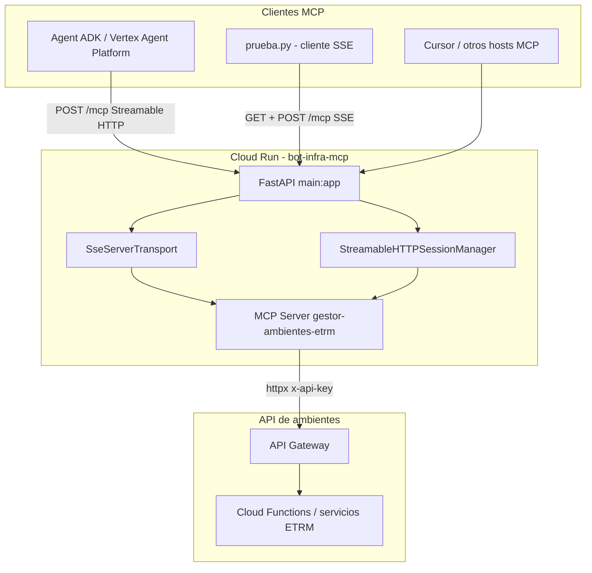
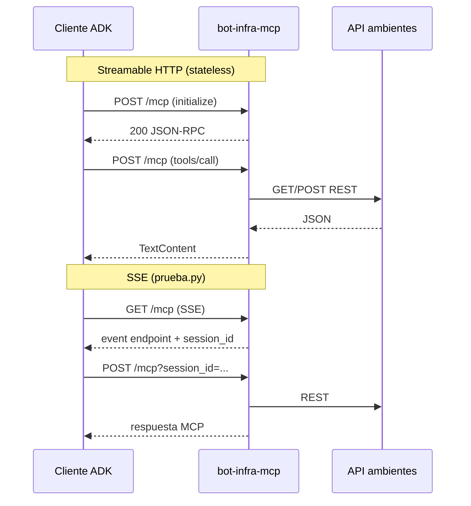

# Guía de estudio: bot-infra-mcp

Documentación para estudiar **a fondo** esta aplicación: qué problema resuelve, cómo está construida, qué protocolos usa y cómo operarla en local y en GCP.

**Repositorio:** servidor MCP (Model Context Protocol) que expone herramientas para consultar y controlar ambientes ETRM, delegando la lógica real a una API REST detrás de un API Gateway.

---

## Tabla de contenidos

1. [Resumen ejecutivo](#1-resumen-ejecutivo)
2. [Conceptos que debes dominar primero](#2-conceptos-que-debes-dominar-primero)
3. [Arquitectura del sistema](#3-arquitectura-del-sistema)
4. [Estructura del repositorio](#4-estructura-del-repositorio)
5. [Stack tecnológico](#5-stack-tecnológico)
6. [Protocolo MCP en esta aplicación](#6-protocolo-mcp-en-esta-aplicación)
7. [Transportes HTTP: SSE vs Streamable HTTP](#7-transportes-http-sse-vs-streamable-http)
8. [Anatomía de `main.py`](#8-anatomía-de-mainpy)
9. [Herramientas MCP y API backend](#9-herramientas-mcp-y-api-backend)
10. [Variables de entorno](#10-variables-de-entorno)
11. [Cliente de prueba `prueba.py`](#11-cliente-de-prueba-pruebapy)
12. [Contenedor Docker](#12-contenedor-docker)
13. [Despliegue en GCP](#13-despliegue-en-gcp)
14. [Integración con Agent Platform / ADK](#14-integración-con-agent-platform--adk)
15. [Flujos paso a paso (trazas mentales)](#15-flujos-paso-a-paso-trazas-mentales)
16. [Diagnóstico de errores frecuentes](#16-diagnóstico-de-errores-frecuentes)
17. [Plan de estudio sugerido](#17-plan-de-estudio-sugerido)
18. [Ejercicios prácticos](#18-ejercicios-prácticos)
19. [Referencias externas](#19-referencias-externas)

---

## 1. Resumen ejecutivo

| Pregunta | Respuesta |
|----------|-----------|
| **¿Qué es?** | Un **servidor MCP** HTTP que un agente de IA (Cursor, Gemini ADK, Vertex Agent Platform, etc.) puede usar como “caja de herramientas”. |
| **¿Qué hace por el agente?** | Dos herramientas: consultar si un ambiente está encendido/apagado y ejecutar encender/apagar. |
| **¿Dónde está la lógica de negocio?** | En otra API (`API_URL_BASE`), no en este repo. Este proyecto es un **adaptador MCP → REST**. |
| **¿Cómo se ejecuta?** | FastAPI + Uvicorn en el puerto **8080**, empaquetado en Docker y desplegado en **Cloud Run** (o Cloud Functions con contenedor). |
| **Endpoint principal** | `GET/POST/DELETE /mcp` |

En una frase: **convierte peticiones estándar MCP en llamadas HTTP a tu API de ambientes y devuelve texto que el LLM puede leer.**

---

## 2. Conceptos que debes dominar primero

### 2.1 Model Context Protocol (MCP)

MCP es un protocolo abierto ([modelcontextprotocol.io](https://modelcontextprotocol.io)) que define cómo un **host** (aplicación con LLM) habla con un **servidor MCP** que ofrece:

- **Tools** — funciones invocables (como “consultar_estado_ambiente”).
- **Resources** — datos legibles (este proyecto no expone resources).
- **Prompts** — plantillas (este proyecto no expone prompts).

La comunicación usa **JSON-RPC 2.0** encapsulado en un transporte (stdio, SSE o Streamable HTTP).

### 2.2 JSON-RPC en MCP

Ejemplos de métodos que intercambian cliente y servidor:

| Método (cliente → servidor) | Propósito |
|---------------------------|-----------|
| `initialize` | Negociar versión de protocolo y capacidades |
| `tools/list` | Listar herramientas disponibles |
| `tools/call` | Ejecutar una herramienta con argumentos |

El SDK Python (`mcp`) serializa/deserializa estos mensajes; tú solo registras handlers con decoradores `@mcp_server.list_tools()` y `@mcp_server.call_tool()`.

### 2.3 ASGI, FastAPI y Starlette

- **ASGI** es la interfaz async entre el servidor HTTP (Uvicorn) y la app.
- **FastAPI** construye rutas HTTP (`@app.get`, `@app.post`).
- Parte del transporte MCP **escribe la respuesta directamente** con `send` ASGI, sin devolver un `Response` normal → por eso existe `AlreadyHandledResponse`.

### 2.4 Adaptador vs dominio

Este código **no decide** políticas de ambientes; solo:

1. Valida argumentos mínimos.
2. Llama a `GET /status/{ambiente}` o `POST /control`.
3. Formatea la respuesta como `TextContent` para el agente.

Separar adaptador (MCP) y dominio (API Gateway) es un principio de diseño deliberado.

---

## 3. Arquitectura del sistema



### Capas

| Capa | Componente | Responsabilidad |
|------|------------|-----------------|
| 1 | Agente / host MCP | Razonamiento, elegir herramienta, mostrar resultado al usuario |
| 2 | Transporte HTTP | SSE o Streamable HTTP en `/mcp` |
| 3 | `mcp.server.Server` | Protocolo MCP, listado y ejecución de tools |
| 4 | `handle_call_tool` | Mapeo tool → REST con `httpx` |
| 5 | API Gateway + backend | Estado real de ambientes ETRM |

---

## 4. Estructura del repositorio

```
bot-infra-mcp/
├── main.py              # Aplicación completa: MCP + FastAPI + rutas
├── prueba.py            # Cliente MCP de prueba (transporte SSE)
├── requirements.txt     # Dependencias Python
├── Dockerfile           # Imagen para Cloud Run
├── .dockerignore        # Excluye venv, .env, .git del build
├── .env                 # Secretos locales (NO commitear)
├── .gitignore
├── venv/                # Entorno virtual local
└── docs/
    └── GUIA_ESTUDIO.md  # Este archivo
```

No hay carpetas `src/`, tests automatizados ni OpenSpec en el repo actual: es un **servicio monolítico pequeño** centrado en un solo archivo.

---

## 5. Stack tecnológico

| Paquete | Rol en el proyecto |
|---------|-------------------|
| `mcp` | SDK oficial: `Server`, transportes SSE y Streamable HTTP, tipos `Tool`, `TextContent` |
| `fastapi` | App HTTP y modelo `Request` |
| `uvicorn[standard]` | Servidor ASGI en producción |
| `httpx` | Cliente HTTP async hacia la API de ambientes |
| `python-dotenv` | Carga `.env` en desarrollo local |

**Python:** 3.12 (según `Dockerfile`).

---

## 6. Protocolo MCP en esta aplicación

### 6.1 Servidor MCP registrado

```python
mcp_server = Server("gestor-ambientes-etrm")
```

El nombre `"gestor-ambientes-etrm"` identifica el servidor en el handshake `initialize`.

### 6.2 Ciclo de vida de una sesión (conceptual)

1. Cliente envía `initialize`.
2. Servidor responde con capacidades (tools, etc.).
3. Cliente puede enviar `tools/list` y `tools/call`.
4. Servidor ejecuta `handle_call_tool` y devuelve contenido.

En **Streamable HTTP stateless**, cada POST puede crear un ciclo corto independiente (ideal para Cloud Run con varias instancias).

En **SSE**, el ciclo vive mientras dura el `GET /mcp` abierto; los `POST` llevan el mismo `session_id`.

### 6.3 Contrato de herramientas

Las herramientas se declaran con **JSON Schema** en `inputSchema` (el agente sabe qué parámetros pedir):

- `consultar_estado_ambiente` → `{ "ambiente": "string" }`
- `ejecutar_accion_ambiente` → `{ "ambiente", "accion": "encender"|"apagar" }`

El LLM no “adivina” la API REST: solo ve el esquema MCP.

---

## 7. Transportes HTTP: SSE vs Streamable HTTP

Esta app implementa **ambos** en la misma ruta `/mcp`. El enrutamiento está en `_is_streamable_http_request` y `_is_legacy_sse_post`.

### 7.1 SSE (legacy en MCP, aún usado por `prueba.py`)

| Paso | HTTP | Detalle |
|------|------|---------|
| 1 | `GET /mcp` | Conexión SSE larga; el servidor crea un `session_id` (UUID en hex) |
| 2 | Evento SSE `endpoint` | Indica al cliente: enviar mensajes a `POST /mcp?session_id=<hex>` |
| 3 | `POST /mcp?session_id=...` | JSON-RPC hacia esa sesión |

**Limitación en Cloud Run:** `_read_stream_writers` vive **en memoria del proceso**. Si el `GET` cae en la instancia A y el `POST` en la instancia B → error 400/404. Mitigaciones: `max-instances=1`, session affinity, o no usar SSE en producción multi-réplica.

### 7.2 Streamable HTTP (recomendado para GCP Agent Platform / ADK)

| Paso | HTTP | Detalle |
|------|------|---------|
| 1 | `POST /mcp` | Sin `session_id` en query; cuerpo JSON-RPC (`initialize`, etc.) |
| 2 | Respuesta | Puede devolver cabecera `mcp-session-id` (modo stateful) o ser autocontenido (stateless) |
| 3 | `GET /mcp` + `mcp-session-id` | Opcional: stream SSE para notificaciones del servidor |
| 4 | `DELETE /mcp` + `mcp-session-id` | Cerrar sesión |

**Modo por defecto en este proyecto:** `MCP_STREAMABLE_STATELESS=1` → cada POST es independiente; funciona con N instancias en Cloud Run.

### 7.3 Tabla de decisión del enrutador

| Petición | Condición | Transporte |
|----------|-----------|------------|
| `POST /mcp` | Sin `session_id` en query | **Streamable HTTP** |
| `POST /mcp` | Con `session_id` en query | **SSE** |
| `GET /mcp` | Cabecera `mcp-session-id` presente | **Streamable HTTP** |
| `GET /mcp` | Sin esa cabecera | **SSE** (`connect_sse`) |
| `DELETE /mcp` | Con `mcp-session-id` | **Streamable HTTP** |

### 7.4 Diagrama comparativo



---

## 8. Anatomía de `main.py`

Estudio recomendado **en este orden** (de arriba a abajo en el archivo).

### 8.1 Configuración y utilidades (líneas ~1–165)

| Bloque | Qué aprender |
|--------|----------------|
| `load_dotenv()` | Variables locales desde `.env` |
| `API_KEY`, `API_BASE_URL` | Credenciales y base URL del backend |
| `_tool_text_for_mcp` | Normalización Unicode → ASCII-friendly para serializadores estrictos |
| `MCP_SSE_STRICT_SESSION` | Desactiva “adivinar” session_id en SSE |
| `MCP_STREAMABLE_STATELESS` | Modo Cloud Run-friendly |
| `MCP_DEBUG` + `_mcp_debug` | Observabilidad sin filtrar secretos (`_mcp_mask_token`) |
| `_lifespan` | Arranca `StreamableHTTPSessionManager.run()` al iniciar Uvicorn |
| `AlreadyHandledResponse` | Patrón ASGI: respuesta ya enviada por el transporte |

### 8.2 Núcleo MCP (líneas ~165–245)

| Bloque | Qué aprender |
|--------|----------------|
| `mcp_server = Server(...)` | Instancia del protocolo |
| `@mcp_server.list_tools()` | Catálogo visible para el agente |
| `@mcp_server.call_tool()` | Puente hacia `httpx` y formato de salida |

**Punto clave:** `handle_call_tool` es el único lugar donde se ejecuta lógica “de negocio” (en realidad, orquestación HTTP).

### 8.3 Transportes y enrutamiento (líneas ~247–491)

| Bloque | Qué aprender |
|--------|----------------|
| `sse = SseServerTransport("/mcp")` | Path base del evento `endpoint` |
| `_streamable_session_manager` | Gestor del SDK para Streamable HTTP |
| `_scope_for_mcp_post` | Compatibilidad: query, cabeceras, heurística SSE |
| `_RECENT_MCP_SESSION_HEX` | Cola de sesiones recientes cuando el SDK no limpia writers |
| `@app.get/post/delete("/mcp")` | Punto de entrada HTTP público |
| `@app.post("/messages")` | Alias histórico; mismo comportamiento que `POST /mcp` |

---

## 9. Herramientas MCP y API backend

### 9.1 `consultar_estado_ambiente`

```
MCP tools/call
  → GET {API_URL_BASE}/status/{ambiente}
  → Header: x-api-key: {API_KEY_AMBIENTES}
  → Respuesta: JSON serializado a texto UTF-8
```

### 9.2 `ejecutar_accion_ambiente`

```
MCP tools/call
  → POST {API_URL_BASE}/control
  → Body: { "ambiente": "...", "accion": "encender"|"apagar" }
  → Respuesta: resume data["resultados"] por recurso
```

Ejemplo de forma de respuesta esperada del backend (ilustrativo):

```json
{
  "resultados": {
    "servicio-a": { "messages": ["OK"] },
    "servicio-b": { "messages": ["En progreso"] }
  }
}
```

El código toma el **último** mensaje de cada recurso y construye un texto plano para el LLM.

### 9.3 Manejo de errores

- Excepciones de red/HTTP → string en `TextContent` (el agente ve el error como texto).
- Tool desconocida → `"Herramienta no encontrada."`
- Sin argumentos → `"Error: Faltan argumentos."`

No hay reintentos ni circuit breaker: diseño simple KISS.

---

## 10. Variables de entorno

| Variable | Obligatoria | Default | Descripción |
|----------|-------------|---------|-------------|
| `API_KEY_AMBIENTES` | Sí (prod) | — | API key enviada como `x-api-key` al Gateway |
| `API_URL_BASE` | Sí (prod) | `""` | Base URL sin barra final, ej. `https://.../api/v1` |
| `MCP_STREAMABLE_STATELESS` | No | `1` (true) | Streamable HTTP sin estado entre POST |
| `MCP_SSE_STRICT_SESSION` | No | false | No inferir `session_id` en SSE |
| `MCP_DEBUG` | No | false | Logs `[MCP-DEBUG]` y boot extendido |

Variables **inyectadas por Cloud Run** (solo lectura, útiles en logs):

- `K_SERVICE` — nombre del servicio
- `K_REVISION` — revisión desplegada

**Seguridad:** nunca subas `.env` a git. El `.dockerignore` excluye `.env` del build; en GCP configura secretos o variables en la consola / Secret Manager.

---

## 11. Cliente de prueba `prueba.py`

Propósito: validar el servidor **sin un agente completo**, usando el cliente SSE del SDK.

```bash
# Terminal 1 — servidor
cd /ruta/bot-infra-mcp
source venv/bin/activate
export $(grep -v '^#' .env | xargs)   # o usar dotenv automático
uvicorn main:app --host 127.0.0.1 --port 8080

# Terminal 2 — cliente
./venv/bin/python prueba.py --consultar
./venv/bin/python prueba.py --ambiente ETRM-QA --accion apagar
```

Flujo interno:

1. `sse_client(url)` → `GET /mcp`
2. `ClientSession.initialize()`
3. `session.call_tool(...)`

**Nota:** Este cliente usa **SSE**, no Streamable HTTP. Para probar como Agent Platform, usa un script con `streamable_http_client` (ver ejercicio 18.3).

---

## 12. Contenedor Docker

```dockerfile
FROM python:3.12-slim
WORKDIR /app
COPY requirements.txt .
RUN pip install --no-cache-dir -r requirements.txt
COPY . .
EXPOSE 8080
CMD ["uvicorn", "main:app", "--host", "0.0.0.0", "--port", "8080"]
```

| Decisión | Motivo |
|----------|--------|
| `PYTHONUNBUFFERED=1` | Logs inmediatos en Cloud Logging |
| `slim` | Imagen pequeña para Cloud Run |
| Puerto 8080 | Convención Cloud Run |
| Sin multi-stage | Proyecto simple; una etapa basta |

Build y run local:

```bash
docker build -t bot-infra-mcp .
docker run --rm -p 8080:8080 \
  -e API_KEY_AMBIENTES=*** \
  -e API_URL_BASE=https://tu-gateway/api/v1 \
  bot-infra-mcp
```

---

## 13. Despliegue en GCP

### 13.1 Modelo de despliegue

- Servicio **stateless** en Cloud Run.
- Escala a cero posible (coste bajo sin tráfico).
- HTTPS terminado por Google; tu app escucha HTTP en 8080 dentro del contenedor.

### 13.2 Checklist de despliegue

1. Construir y subir imagen (Artifact Registry) o `gcloud run deploy --source .`
2. Configurar `API_KEY_AMBIENTES` y `API_URL_BASE`
3. Mantener `MCP_STREAMABLE_STATELESS=1` si el agente es Agent Platform / ADK
4. Autenticación:
   - Si el servicio exige IAM: el agente debe enviar `Authorization: Bearer <ID token>`
   - Si es público con API key en backend: solo la key hacia el Gateway (como ahora)
5. URL del agente: `https://<servicio>-<hash>-<region>.run.app/mcp`

### 13.3 Observabilidad

- Buscar `[MCP-BOOT]` al arrancar instancia nueva
- Con `MCP_DEBUG=1`: líneas `[MCP-DEBUG] Streamable HTTP` vs rutas SSE
- Errores 400 con texto `session_id is required` → cliente SSE sin GET previo o réplica distinta

---

## 14. Integración con Agent Platform / ADK

En Google ADK la configuración típica es:

```python
from google.adk.tools.mcp_tool.mcp_toolset import MCPToolset, StreamableHTTPConnectionParams

mcp_tools = MCPToolset(
    connection_params=StreamableHTTPConnectionParams(
        url="https://tu-servicio.run.app/mcp",
        headers={"Authorization": f"Bearer {id_token}"},  # si Cloud Run es privado
    ),
)
```

**Errores que ya viste en producción:** Agent Platform hace `POST /mcp` sin `session_id` en query. Sin Streamable HTTP en el servidor → 400. Con el código actual → debe responder 200/202.

Documentación Google:

- [Host MCP servers on Cloud Run](https://cloud.google.com/run/docs/host-mcp-servers)
- [Codelab ADK + MCP en Cloud Run](https://codelabs.developers.google.com/codelabs/cloud-run/use-mcp-server-on-cloud-run-with-an-adk-agent)

---

## 15. Flujos paso a paso (trazas mentales)

### 15.1 Agente pregunta “¿está encendido ETRM-QA?”

1. LLM decide usar tool `consultar_estado_ambiente`.
2. Host MCP envía `tools/call` por Streamable HTTP → `POST /mcp`.
3. `handle_call_tool` → `GET .../status/ETRM-QA`.
4. JSON del backend → texto → `TextContent` → JSON-RPC response.
5. El agente lee el texto y responde al usuario en lenguaje natural.

### 15.2 Cold start en Cloud Run

1. Primera petición despierta el contenedor.
2. `_lifespan` imprime `[MCP-BOOT]` y arranca `session_manager`.
3. TCP probe en 8080 OK.
4. Procesa `POST /mcp` (initialize + tools).

---

## 16. Diagnóstico de errores frecuentes

| Síntoma | Causa probable | Acción |
|---------|----------------|--------|
| `400 session_id is required` | Cliente SSE o POST sin sesión previa | Agent Platform: redeploy con Streamable HTTP; SSE: mismo pod o max-instances=1 |
| `writers=0` en logs | POST SSE en instancia sin GET previo | Session affinity o usar Streamable HTTP |
| `404 Could not find session` | session_id expirado o otra réplica | Reconectar GET SSE o POST stateless |
| `406 Not Acceptable` | Cliente sin `Accept: application/json` (+ SSE si aplica) | Revisar headers del host MCP |
| Tool OK pero API falla | `API_URL_BASE` / key incorrectos | Ver `[MCP-BOOT] API_URL_BASE_len` y probar curl al Gateway |
| Timeout | Backend lento (>15s) | Ajustar `timeout=15.0` en httpx si hace falta |

---

## 17. Plan de estudio sugerido

Estimación: **4–6 sesiones** de 1–2 horas.

| Sesión | Tema | Actividad |
|--------|------|-----------|
| 1 | MCP + JSON-RPC | Leer [MCP docs transports](https://modelcontextprotocol.io/specification/2025-03-26/basic/transports); dibujar host/servidor |
| 2 | `main.py` tools | Leer §8.2 y §9; trazar `handle_call_tool` con papel y lápiz |
| 3 | Transportes | Leer §7; comparar logs SSE vs Streamable con `MCP_DEBUG=1` |
| 4 | Docker + local | Levantar uvicorn + `prueba.py`; curl manual a `/mcp` (opcional) |
| 5 | GCP | Revisar logs Cloud Run, variables, IAM si aplica |
| 6 | Agente ADK | Codelab Google; conectar un agente de prueba a tu URL |

---

## 18. Ejercicios prácticos

### 18.1 — Lectura dirigida

En `main.py`, responde por escrito:

1. ¿Qué devuelve `AlreadyHandledResponse` y por qué status 204?
2. ¿Cuándo se añade un UUID al deque `_RECENT_MCP_SESSION_HEX`?
3. ¿Qué pasa si llamas `ejecutar_accion_ambiente` sin `accion`?

### 18.2 — Experimento SSE local

1. Arranca el servidor con `MCP_DEBUG=1`.
2. Ejecuta `prueba.py --consultar`.
3. En logs, identifica: registro de sesión SSE, POST con `session_id` en query.

### 18.3 — Cliente Streamable HTTP (como ADK)

Crea `prueba_streamable.py`:

```python
import asyncio
from mcp.client.session import ClientSession
from mcp.client.streamable_http import streamable_http_client

async def main():
    url = "http://127.0.0.1:8080/mcp"
    async with streamable_http_client(url) as (read, write, _):
        async with ClientSession(read, write) as session:
            await session.initialize()
            tools = await session.list_tools()
            print([t.name for t in tools.tools])

asyncio.run(main())
```

Debes ver `200` en logs del servidor y la lista de tools.

### 18.4 — Simular error multi-réplica (conceptual)

Documenta en un párrafo por qué `MCP_STREAMABLE_STATELESS=1` evita el problema de `writers=0` entre pods.

### 18.5 — Extensión (opcional)

Diseña una tercera tool `listar_ambientes` sin implementarla: define `inputSchema`, endpoint REST hipotético y riesgos de seguridad.

---

## 19. Referencias externas

| Recurso | URL |
|---------|-----|
| MCP — Introducción | https://modelcontextprotocol.io/docs/learn/server-concepts |
| MCP — Transports | https://modelcontextprotocol.io/specification/2025-03-26/basic/transports |
| SDK Python MCP | https://github.com/modelcontextprotocol/python-sdk |
| Cloud Run + MCP | https://cloud.google.com/run/docs/host-mcp-servers |
| ADK + MCP codelab | https://codelabs.developers.google.com/codelabs/cloud-run/use-mcp-server-on-cloud-run-with-an-adk-agent |
| FastAPI lifespan | https://fastapi.tiangolo.com/advanced/events/ |
| httpx async | https://www.python-httpx.org/async/ |

---

## Apéndice A — Mapa rápido de funciones en `main.py`

| Función / clase | Rol |
|-----------------|-----|
| `_tool_text_for_mcp` | Sanitizar texto de salida |
| `_mcp_is_debug`, `_mcp_debug`, `_print_mcp_boot_once` | Diagnóstico |
| `_lifespan` | Ciclo de vida FastAPI + session manager |
| `AlreadyHandledResponse` | No duplicar respuesta ASGI |
| `handle_list_tools` | Catálogo MCP |
| `handle_call_tool` | Ejecución + httpx |
| `_is_legacy_sse_post` / `_is_streamable_http_request` | Enrutador de transporte |
| `_scope_for_mcp_post` | Inyección session_id para SSE |
| `_mcp_post_message` | POST vía SSE transport |
| `_handle_streamable_http` | POST/GET/DELETE vía Streamable HTTP |
| `mcp_sse` | GET → SSE o Streamable |
| `handle_messages` | POST → Streamable o SSE |
| `mcp_delete` | DELETE sesión Streamable |
| `mcp_messages` | Alias POST `/messages` |

---

## Apéndice B — Glosario

| Término | Definición breve |
|---------|------------------|
| **Host MCP** | Aplicación que aloja al LLM y al cliente MCP (Cursor, ADK, etc.) |
| **Tool** | Función remota invocable vía MCP |
| **SSE** | Server-Sent Events; conexión HTTP larga unidireccional servidor→cliente |
| **Streamable HTTP** | Transporte MCP moderno sobre un solo endpoint HTTP |
| **Session ID** | Identificador de conversación MCP (query `session_id` o header `mcp-session-id`) |
| **ASGI** | Interfaz estándar Python async para servidores web |
| **API Gateway** | Puerta de entrada HTTP gestionada (en tu caso, URL en `API_URL_BASE`) |

---

*Última actualización: alineada con `main.py` que incluye Streamable HTTP + SSE dual en `/mcp`.*
